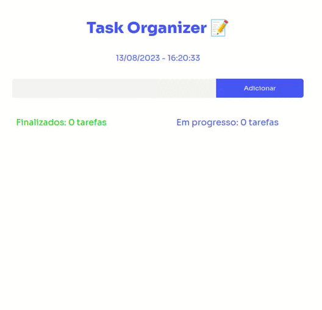

<div align="center">

# Task Organizer
  


https://task-organizer-tv79.vercel.app/

</div> 
 
##

## :memo: Descrição
<p> O Task Organizer é um aplicativo de lista de tarefas desenvolvido em React com TypeScript. Ele permite aos usuários gerenciar suas tarefas, adicionando, editando, excluindo, marcando como concluídas e removendo tarefas concluídas. O aplicativo utiliza o armazenamento local (LocalStorage) para manter a persistência dos dados da lista de tarefas.</p>

## 🔍 Funcionalidades 
- Adicionar tarefas à lista.
- Editar tarefas existentes.
- Excluir tarefas da lista.
- Marcar tarefas como concluídas.
- Remover tarefas concluídas.
- Exibir o status das tarefas em andamento.
- Exibir o status das tarefas finalizadas.
- Exibir a data e hora atual.


##  💻 Instalação
- Faça o clone deste repositório para o seu ambiente local.
- Navegue até o diretório raiz do projeto.
- Execute o comando npm install para instalar as dependências.

## ▶️ Execução
Após a instalação das dependências, execute o seguinte comando para iniciar o aplicativo.
 
```js
  
npm run dev

```

## Como Usar

1. Abra o aplicativo no seu navegador.

2. Adicione novas tarefas usando o campo de entrada e o botão "Adicionar Tarefa".

3. Edite uma tarefa clicando no ícone de edição ao lado da tarefa.

4. Marque uma tarefa como concluída clicando na caixa de seleção ao lado da tarefa.

5. Remova uma tarefa concluída clicando no ícone de exclusão ao lado da tarefa concluída.

6. Exclua uma tarefa não concluída clicando no ícone de exclusão ao lado da tarefa.


## :wrench: Tecnologias utilizadas

- React Vite

- TypeScript


